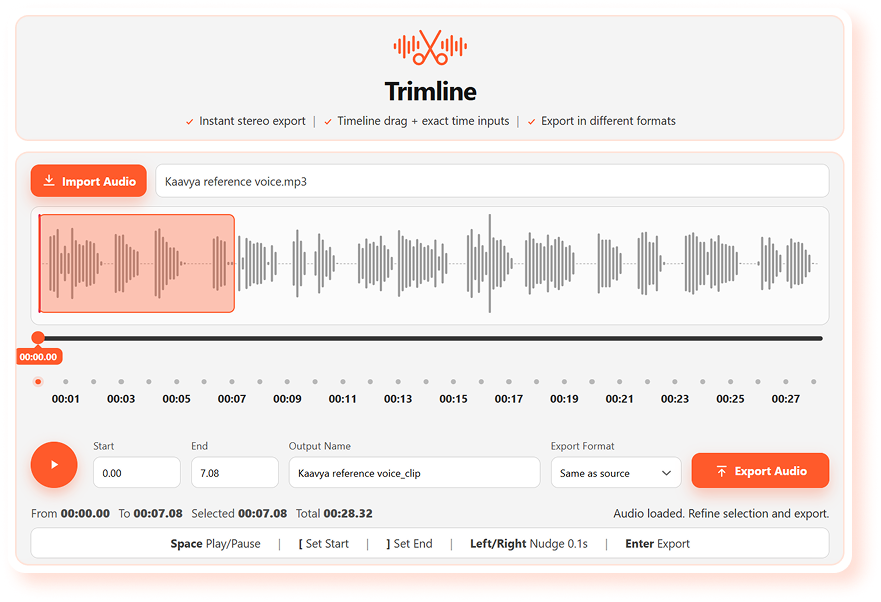

# Trimline

[](https://github.com/its-abhishek-agarwal/trimline/releases/latest)
[](https://github.com/its-abhishek-agarwal/trimline/releases)
[](https://its-abhishek-agarwal.github.io/trimline/website/)
[](https://github.com/its-abhishek-agarwal/trimline/releases/latest)
[](https://ko-fi.com/hiabhishek)
[](https://razorpay.me/@hi_abhishek)

Trimline is a simple, fast audio trimming app for Windows.
Import audio, choose the exact range on waveform, name output, and export instantly.

## Live Website

https://its-abhishek-agarwal.github.io/trimline/website/

## Preview



## Why Trimline

- Built for quick clipping, not complex editing.
- Local-first: your audio stays on your machine.
- One-screen workflow: import -> trim -> export.

## Features

- Supports common audio formats: MP3, WAV, M4A/AAC, FLAC, OGG.
- Waveform-based trim with draggable handles.
- Exact start/end time input for precision.
- Keyboard nudging for fine control.
- Export in multiple formats, including same-as-source.
- Stereo export output.

## Download

- Latest release page:
  https://github.com/its-abhishek-agarwal/trimline/releases/latest
- Direct `.exe`:
  https://github.com/its-abhishek-agarwal/trimline/releases/latest/download/Trimline-Windows-Setup.exe
- Direct `.msi`:
  https://github.com/its-abhishek-agarwal/trimline/releases/latest/download/Trimline-Windows-Installer.msi

Which one should you use?

- `.exe` -> best for most users.
- `.msi` -> useful for managed/business installs.

## How To Use

1. Click `Import Audio`.
2. Drag trim handles on waveform.
3. Optionally edit start/end and output name.
4. Click `Export Audio`.

## Support

- Ko-fi: https://ko-fi.com/hiabhishek
- Razorpay: https://razorpay.me/@hi_abhishek

## For Developers

```bash
npm ci
npm run dev
```

Website preview:

```bash
npm run web:dev
```

Build app + website:

```bash
npm run build
```

Build Windows installers:

```bash
npx tauri build --bundles nsis,msi
```

Deployment guide:

- [`DEPLOYMENT.md`](./DEPLOYMENT.md)
